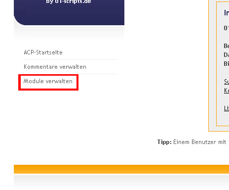
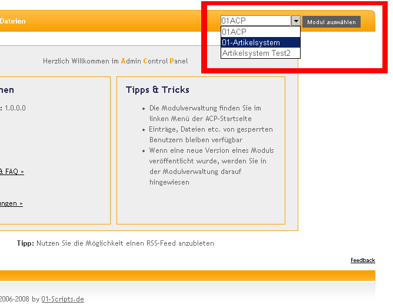

# 01-Artikelsystem

Das **01-Artikelsystem** ermöglicht es ihnen alle Texte auf ihrer Internetseite direkt online zu verwalten. Realisiert als Modul für das [01ACP](https://github.com/01-Scripts/01ACP), bettet es sich nahtlos in den zentralen Administrationsbereich ein und ermöglicht die komplette Verwaltung über eine Oberfläche.  
Mit dem 01-Artikelsystem können Sie Newseinträge verfassen, Kategorien verwalten und ihren Mitarbeitern und Redakteuren über die Benutzerverwaltung gezielt die passenden Rechte vergeben.  
Ein integriertes Kommentarsystem sowie die Integration von [Disqus](https://disqus.com/), die Datei- und Bild-Upload-Verwaltung des Administrationsbereichs und ein WYSIWYG-Editor zur Erstellung der Beiträge runden das Script ab.  
Seit Version 3.2.0 ist es außerdem möglich in News-Einträgen direkt Bilder aus Alben einer ebenfalls installierten [01-Gallery](https://github.com/01-Scripts/01-Gallery) zu verwenden.  
[Demo und weitere Informationen](https://www.01-scripts.de/downloads.php)

## Features

-   Einsetzbar als Blog-System, CMS, Newsscript, Artikelsystem, etc...
-   WYSIWYG-Editor (TinyMCE) zum Erstellen und Bearbeiten von Artikeln und Seiten.
-   Integriertes Datei- und Bildupload-System sowie Unterstützung der [01-Gallery](https://github.com/01-Scripts/01-Gallery)
-   Lightbox zur komfortablen Präsentation von Bildern
-   RSS-Feed für Einträge und Kommentare sowie eine Archiv-Funktion
-   *Sprechende Links-   durch mod_rewrite-Unterstützung
-   Unterstützung für [Disqus](https://disqus.com/) oder eigenes Kommentarsystem
-   [reCAPTCHA](https://www.google.com/recaptcha/admin) oder eigenes Antispam-System
-   Template-System inkl. komplettem CSS-Layout für einfache Design-Änderungen
-   kostenlos (CC BY-NC-SA-Lizenz)

## Download

Die jeweils aktuellste Version des 01-Artikelsystem kann unter
[https://www.01-scripts.de/down_zip.php?godownload=1&01article=1&01acp=1](https://www.01-scripts.de/down_zip.php?godownload=1&01article=1&01acp=1)
heruntergeladen werden.

Einzelne Update-Pakete für alle veröffentlichten Updates sind hier zu finden:
[https://www.01-scripts.de/downloads.php](https://www.01-scripts.de/downloads.php)

## Installation

### Den Administrationsbereich (01ACP) installieren

Um einzelne Module wie das [01-Artikelsystem](https://github.com/01-Scripts/01-Artikelsystem) oder die [01-Gallery](https://github.com/01-Scripts/01-Gallery) zu installieren, muss zuerst einmalig der für alle Module benötigte Administrationsbereich (das [01ACP](https://github.com/01-Scripts/01ACP)) installiert werden:

#### Dateien hochladen

Entpacken sie das heruntergeladene .zip-Archiv in einen beliebigen Ordner auf ihrer lokalen Festplatte.  
Im Verzeichnis  `Administrationsbereich/`  finden sie das Verzeichnis  `01scripts/`  das alle Dateien zur Installation des 01ACP enthält.  
Laden sie das gesamte  `01scripts/`-Verzeichnis mit ihrem  FTP-Programm  in das Hauptverzeichnis ihrer Internetseite hoch. Achten sie dabei unbedingt darauf, dass die Datei- und Verzeichnisstruktur erhalten bleibt!  
  
Im Idealfalls sollte sich nach dem Hochladen der Daten das Verzeichnis  `01scripts/`  auf der gleichen Verzeichnisebene befinden wie ihre Index- oder Startdatei (meist index.php).

#### Installation des 01ACP starten

Nachdem sie alle Dateien auf ihren Webspace hochgeladen haben rufen sie in ihrem Browser bitte folgende Internetadresse auf:  
`http://www.ihre-domain.de/01scripts/01acp/install.php`  
  
Falls sich das Verzeichnis  `01scripts/`  **nicht**  im Hauptverzeichnis ihrer Internetseite befindet, müssen sie den Pfad der URL entsprechend anpssen:  
`http://www.ihre-domain.de/pfad-zum-script/01scripts/01acp/install.php`  
  
Sie werden anschließend mit der Installationsroutine durch die weitere Installation des 01ACP geführt. Folgen sie dazu einfach den Anweisungen auf dem Bildschirm.

#### Module installieren

Nachdem sie das 01ACP erfolgreich installiert haben und den ersten Benutzer-Account angelegt haben löschen sie bitte aus Sicherheitsgründen die beiden Dateien install.php und install_sql.php!  
Anschließend loggen sie sich bitte mit ihrem Admin-Account den sie bei der Installation angelegt haben, in den Administrationsbereich ein:  
`http://www.ihre-domain.de/01scripts/01acp/index.php`

### Module in das 01ACP installieren

Für die weiteren Schritte muss das 01ACP bereits installiert sein!

#### Modul-Verzeichnis hochladen

Wenn sie es noch nicht getan haben, dann entpacken sie das von  01-Scripts.de  heruntergeladene .zip-Archiv in einen beliebigen Ordner auf ihrer lokalen Festplatte.  
Im Verzeichnis  `Module/`  finden sie das von ihnen heruntergeladene Modul in einem Verzeichnis.  
Laden sie das Verzeichnis (z.B.  `01article/`) mit ihrem  FTP-Programm  in folgendes Verzeichnis:  
`/pfad-zum-script/01scripts/01module/`

#### Hochgeladenes Modul installieren

Loggen sie sich nun mit ihrem Admin-Account in das 01ACP ein.  
Nach dem Login finden sie im linken Menü der 01ACP-Startseite den Menüpunkt _Module verwalten_  klicken sie auf ihn.



In der erscheinenden Tabelle werden alle vorhandenen Module aufgelistet. Mit einem Klick auf den grünen Plus-Button starten sie die Installation des gewünschten Moduls.  
Geben sie einen Installationsnamen für das Modul an.  
Nach der Installation steht das Modul sofort zur Verfügung. In den Einstellungen können nun die Einstellungen für das installierte Modul vorgenommen werden.


Die Startseite des Moduls rufen sie über die Drop-Down-Box oben rechts im 01ACP auf:



### 01-Artikelsystem per PHP einbinden

Das 01-Artikelsystem ist darauf ausgelegt per PHP mit dem include()-Befehl in eine bestehende Seite eingebunden zu werden. Es wird dringend empfohlen diese Methode zu verwenden! Der Befehl dafür lautet folgendermaßen:

```php
<?PHP
$subfolder  = "01scripts/";         // Unterverzeichnis
$modul      = "01article";          // Modul- und Verzeichnisname (=ID-Name)
                                    // ggf. ändern
 
// Hier ggf. weitere Parameter einfügen
 
include($subfolder."01module/".$modul."/01article.php");
?>
```

Folgende Parameter können verwendet werden:

```php
<?PHP
// Weitere mögliche Parameter sind:
$show['catid']  = "1,2,3";      // Nur bestimmte Kategorien ausgeben (kommasepariert)
$show['artid']  = 1;            // Einzelnen Artikel / statische Seite ausgeben
$show['search'] = "Suchwort";   // Ausgabe der zu "Suchwort" gefundenen Beiträge
$show['page']   = 2;            // Ausgabe der 2. Seite
$flag_utf8      = FALSE;        // Setzen Sie $flag_utf8 = TRUE; falls Sie Ihre Seite UTF-8-kodiert ausgeben
?>
```

## Lizenz

Das 01-Artikelsystem ist unter [CC BY-NC-SA](https://creativecommons.org/licenses/by-nc-sa/3.0/de/) -Lizenz veröffentlicht

*Namensnennung - Nicht-kommerziell - Weitergabe unter gleichen Bedingungen 3.0 Deutschland*

* Alle PHP-Scripte von [01-Scripts.de](https://www.01-scripts.de) können für den privaten, nicht-kommerziellen Einsatz kostenlos genutzt werden. 
* Für die kommerzielle Nutzung (darunter fällt auch der Einsatz auf Firmenseiten!) können Sie eine Lizenz zur kommerziellen Nutzung [erwerben](https://www.01-scripts.de/shop.php).
* Wenn Sie den sichtbaren Urheberrechtshinweis entfernen möchten, erwerben Sie bitte eine Non-Copyright-Lizenz.

Lizenzen können hier bestellt werden:
[https://www.01-scripts.de/shop.php](https://www.01-scripts.de/shop.php)
